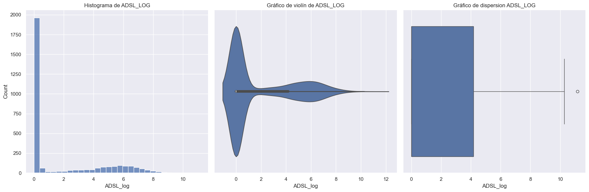
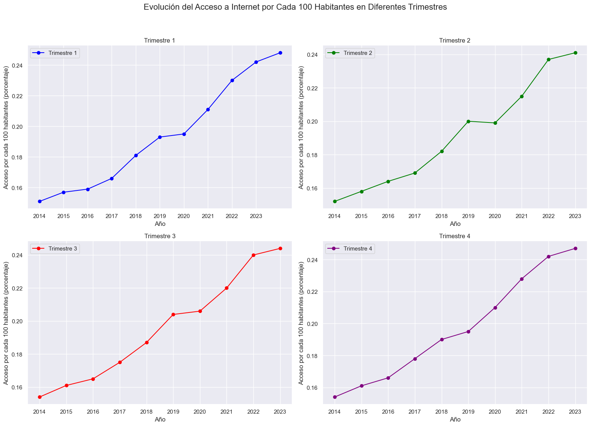
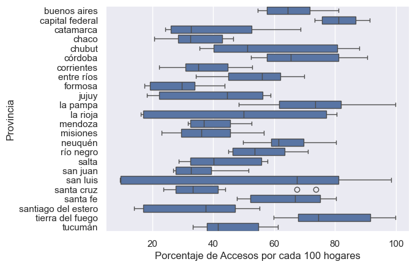

# Proyecto_Henry_Analisis_de_Datos

## Introducción

En la era digital, las telecomunicaciones han transformado radicalmente la manera en que nos conectamos, trabajamos y vivimos. Desde la telefonía y la televisión hasta el internet, la transmisión de información a través de medios electrónicos es esencial para la comunicación global. El internet, en particular, ha revolucionado el intercambio de información, permitiendo que personas, organizaciones y dispositivos interactúen en tiempo real a nivel mundial.

Argentina se encuentra a la vanguardia en el desarrollo de las telecomunicaciones en América Latina, con más de 62 millones de conexiones para 2020. Este sector ha sido fundamental para mantener a la sociedad conectada, especialmente en contextos de crisis como la pandemia mundial, donde la transferencia de datos y la comunicación continua se volvieron indispensables.

En este contexto, he asumido el rol de Analista de Datos para una empresa prestadora de servicios de telecomunicaciones en Argentina. Mi tarea es realizar un análisis exhaustivo del comportamiento del sector a nivel nacional, con un enfoque particular en el acceso a internet, que es la principal actividad de la empresa. Además, consideraré el comportamiento de otros servicios de comunicación para identificar oportunidades de crecimiento, mejorar la calidad del servicio y ofrecer soluciones personalizadas a los clientes.

Este análisis busca convertir los vastos volúmenes de datos en visualizaciones claras y comprensibles que permitan a la empresa tomar decisiones estratégicas informadas, impulsando su eficiencia y crecimiento en un mercado cada vez más competitivo.

## Descripción

En este proyecto, asumí el rol de Analista de Datos para ayudar a la empresa de telecomunicaciones ENACOM en un problema ficticio. El objetivo era generar un análisis que identificara tendencias en el aumento de accesos a la conexión a internet en la última década en Argentina, así como aportar un análisis para identificar patrones y proporcionar visualizaciones que ayuden a entender mejor los datos. El propósito es permitir que ENACOM tome decisiones basadas en datos precisos para promocionar sus servicios y aprovechar oportunidades.

## Tabla de Contenido

1. [Introducción](#Introducción)
2. [Descripción](#Descripción)
3. [KPI Funcionamiento](#KPI)
4. [Análisis de Datos](#Análisis-de-Datos)
5. [Autores](#Autores)

## KPI

En el dashboard de Power BI se definieron dos KPI, uno basado en la propuesta del educador Henry:

- **Aumentar en un 2% el acceso al servicio de internet para el próximo trimestre, cada 100 hogares, por provincia**.

  La fórmula utilizada es la siguiente:
  \[
  KPI = \frac{(\text{Nuevo acceso} - \text{Acceso actual})}{\text{Acceso actual}} \times 100
  \]

  Donde:
  - "Nuevo_acceso" se refiere al número de hogares con acceso a Internet después del próximo trimestre.
  - "Accesos_Totales_Porcentaje_2023" se refiere al número de hogares con acceso a Internet en el trimestre actual.

El otro KPI del dashboard de Power BI es:

- **Aumentar en un 3.8% el acceso al servicio de internet para el próximo trimestre, cada 100 individuos, por provincia**.

  Donde:
  - "Nuevos_ingresos" se refiere al número de individuos con acceso a Internet después del próximo trimestre.
  - "Acceso_cada_100_hab_2023" se refiere al número de individuos con acceso a Internet en el trimestre actual.

## Análisis de Datos

### Acceso por la Tecnología de Conexión ADSL

**Conclusiones:**

1. **Histograma:** 
   La distribución de ADSL_LOG parece ser asimétrica a la derecha, con una alta concentración de valores en torno al valor 11 y algunos valores atípicos muy altos.

2. **Gráfico de Violín:** 
   Confirma la distribución asimétrica a la derecha observada en el histograma, con una alta densidad en valores bajos y una cola más larga hacia la derecha.

3. **Presencia de Outliers:** 
   Tanto el histograma como el gráfico de violín sugieren la presencia de valores atípicos muy altos que podrían estar influyendo en la distribución y en los cálculos estadísticos.

4. **Rango de Valores:** 
   La mayoría de los valores de ADSL_LOG se encuentran entre 0 y aproximadamente 6, aunque hay algunos que alcanzan hasta 12.

**Resumen:** La variable ADSL_LOG muestra una distribución asimétrica con una alta concentración de valores alrededor de 11 y algunos valores atípicos significativos en el extremo superior.

### Acceso por Cada 100 Individuos

**Conclusiones del Análisis de los Gráficos de Accesos por Trimestre:**

1. **Tendencia General:** 
   En los cuatro trimestres, se observa una tendencia ascendente en el porcentaje de accesos por cada 100 habitantes a lo largo de los años, indicando un crecimiento continuo y sostenido.

2. **Comparación entre Trimestres:** 
   Todos los trimestres muestran un crecimiento constante desde 2014 hasta 2023. La pendiente de crecimiento es consistente entre los trimestres, sin diferencias significativas en términos de crecimiento de accesos.

3. **Puntos de Crecimiento Notable:** 
   A partir de 2017, todos los trimestres muestran un aumento más pronunciado en el porcentaje de accesos. Entre 2020 y 2021, se observa un notable incremento, posiblemente relacionado con la pandemia de COVID-19, que impulsó una mayor demanda de accesos debido al trabajo y estudio desde casa.

4. **Año 2023:** 
   El año 2023 muestra el valor más alto en cada trimestre, alcanzando alrededor del 0.24% de accesos por cada 100 habitantes.

5. **Estacionalidad:** 
   No se evidencia una estacionalidad marcada en los datos, con un crecimiento relativamente uniforme entre los trimestres, lo que sugiere un crecimiento constante sin grandes fluctuaciones estacionales.

**Resumen:** Los gráficos muestran un crecimiento continuo en el porcentaje de accesos por cada 100 habitantes en Capital Federal, con un incremento notable a partir de 2017 y valores máximos en 2023. La tendencia es uniforme en los cuatro trimestres, sin estacionalidad significativa.

### Porcentaje de Acceso por Cada 100 Hogares

**Conclusiones:**

1. **Variabilidad de Accesos:** 
   Se observa una gran variabilidad en el porcentaje de accesos entre las provincias. Algunas provincias presentan una alta dispersión, mientras que otras tienen una dispersión más estrecha.

2. **Medianas y Rangos Intercuartílicos:** 
   Provincias como Buenos Aires y Córdoba tienen medianas más altas, indicando un mayor número de accesos por cada 100 hogares, mientras que provincias como Formosa y Santiago del Estero tienen medianas más bajas.

3. **Valores Atípicos:** 
   Se identifican valores atípicos en provincias como Formosa y San Luis, que muestran valores de acceso significativamente diferentes del resto de los datos.

4. **Comparaciones Entre Provincias:** 
   Buenos Aires y Córdoba tienen los mayores niveles de accesos, mientras que provincias como La Pampa y Tucumán tienen medianas similares pero diferentes niveles de variabilidad.

5. **Rangos de Accesos:** 
   La mayoría de las provincias tienen rangos de accesos que varían considerablemente, indicando disparidades en la conectividad dentro de las provincias.

**Resumen:** El gráfico muestra una diversidad considerable en los accesos por cada 100 hogares entre las provincias argentinas, con algunas provincias destacándose por una mayor conectividad y otras con menos accesos. La variabilidad dentro de las provincias también es notable, indicando disparidades en el acceso a servicios.

## Autores

Este proyecto fue realizado por: **Tomas Feiertag**.