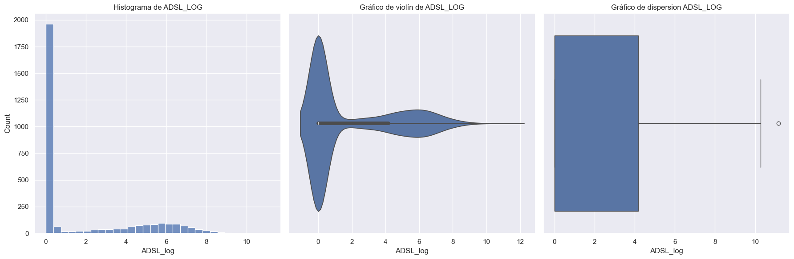
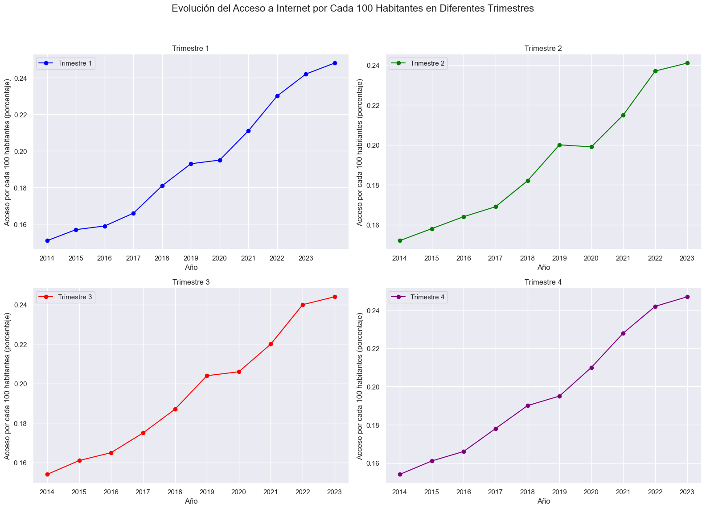
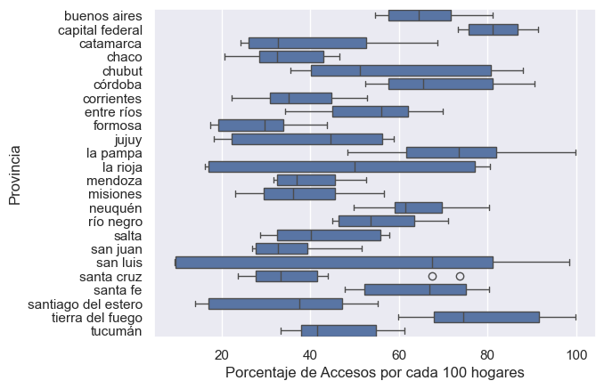

<div align="center">


</div>

---

## 📌 Overview

End-to-end data analytics project analyzing the **evolution of internet access in Argentina** over the last decade using ENACOM public data. Includes full ETL pipeline, exploratory data analysis, KPI definition, and an interactive Power BI dashboard to support strategic decisions.

**Role:** Data Analyst (solo project)  
**Context:** Simulated consulting engagement for ENACOM (Argentina's telecommunications regulator)

---

## 🎯 KPIs Defined

| KPI | Target | Formula |
|---|---|---|
| **Internet access per 100 households** | +2% growth per quarter, per province | `(New Access - Current Access) / Current Access × 100` |
| **Internet access per 100 individuals** | +4.2% growth per quarter, per province | Same formula, per-capita basis |

---

## 🔍 Key Findings

### 📡 ADSL Technology Access
Distribution shows high concentration at low values with notable outliers — asymmetric distribution skewed toward lower connectivity areas.



### 👤 Access per 100 Individuals
Consistent quarterly growth throughout the decade, with a **notable spike in 2020–2021** driven by COVID-19 pandemic (remote work + distance learning). Peak values reached in 2023.



### 🏠 Access per 100 Households by Province
Significant regional disparities: **Buenos Aires and Córdoba** show highest connectivity medians; **Formosa and Santiago del Estero** lag significantly behind.



---

## 🔄 Pipeline

```
ENACOM Raw Data ──► ETL (Python + Pandas) ──► EDA + KPI Analysis ──► Power BI Dashboard
```

- Full ETL pipeline: cleaning, normalization, type conversion
- EDA with trend analysis and outlier detection
- Interactive Power BI dashboard with provincial-level KPIs

---

## ⚒️ Tech Stack

| Layer | Tools |
|---|---|
| **Processing** | Python, Pandas |
| **Analysis** | Jupyter Notebook, Matplotlib |
| **Visualization** | Power BI |

---

## ▶️ How to Run

```bash
git clone https://github.com/TomasFeiertag/Proyecto-Data-Analytics.git
cd Proyecto-Data-Analytics
pip install -r requirements.txt
# Open notebooks/ in Jupyter, then open the .pbix in Power BI Desktop
```

---

## 👤 Author

**Tomás Feiertag** — Data Scientist · NLP & LLMs @ Movistar

[](https://linkedin.com/in/tfeiertag/)
[](https://github.com/TomasFeiertag)


